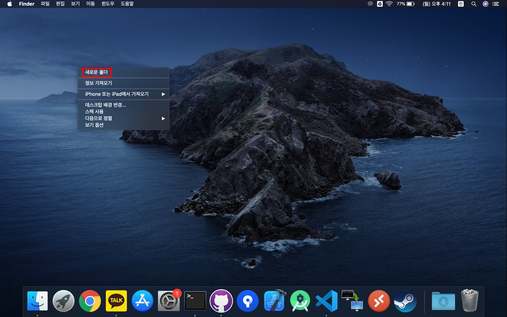
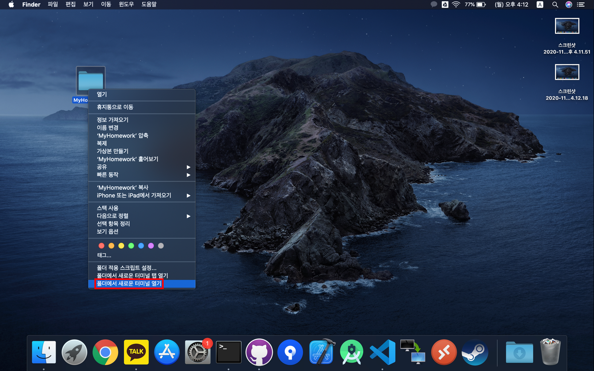

# Allergy Alert

## 사전 설치 (Mac OS 기준)

- Node.js

    [Node.js 메인 페이지](https://nodejs.org/ko/download/)에 접속해 OS에 맞는 버전을 다운로드 후 설치.

- Git

    [Git 메인 페이지](https://git-scm.com/)에 접속해 다운로드 후 설치. 

## 소스코드 받기

- Finder에서 혹은 바탕화면에 애플리케이션의 소스코드를 클론 할 디렉토리 생성 (Control + 우 클릭)
    

- 디렉토리 명은 원하는 대로 지정

    

- 디렉토리에서 Terminal 실행 (Control + 우 클릭)

    

- 터미널 창에서 다음의 명령어를 순서대로 입력 `注) Node.js와 Git이 반드시 설치되어 있어야 합니다!`

    ```sh
    
    git clone https://github.com/ApexCaptain/Allergy-Alert

    cd Allergy-Alert

    sudo npm install

    npm start

    ```
    3번째 명령어(`sudo npm install`) 실행 시 Password를 요청 할 수 있습니다.

    실행하면 자동으로 Chrome 혹은 Safari 등 기본 브라우져가 자동 실행됩니다. 만일 같은 네트워크(같은 공유기 혹은 테더링 등)에 연결되어 있다면 다른 PC나 스마트폰에서도 접속할 수 있습니다. 접속 IP주소는 React 서버를 실행한 PC와 같으면 포트 번호는 `3000`번입니다. 가령 애플리케이션을 실행한 PC의 IP주소가 `123.456.789.1` 이라면 같은 WiFi를 사용하는 다른 PC나 태블릿, 스마트폰에서 접속할 땐 브라우져 검색 창에 `123.456.789.1:3000`이라고 치시면 됩니다.
